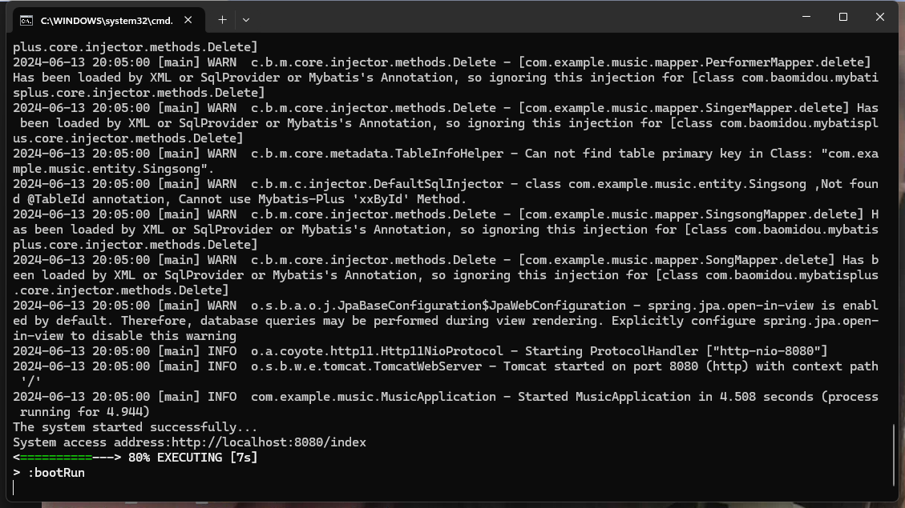
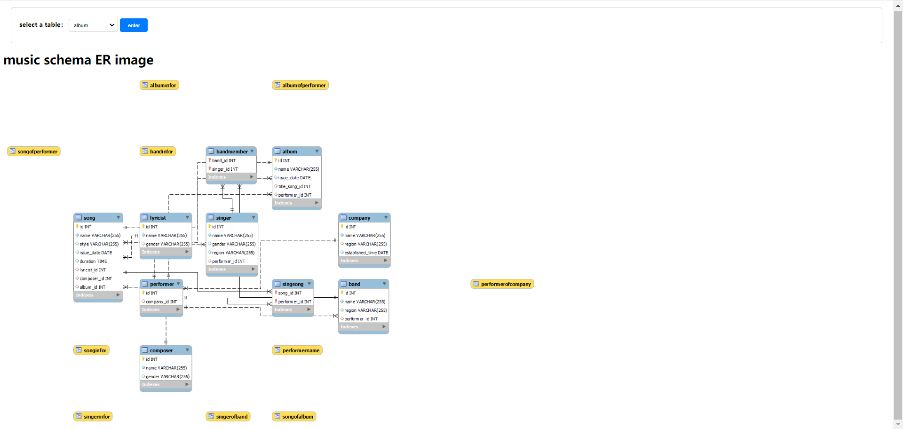
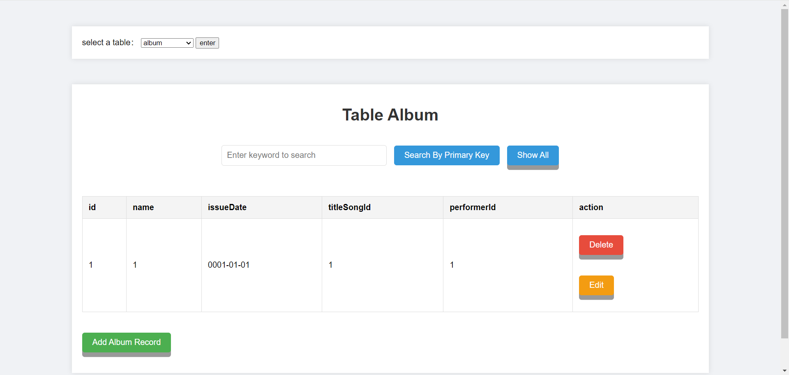
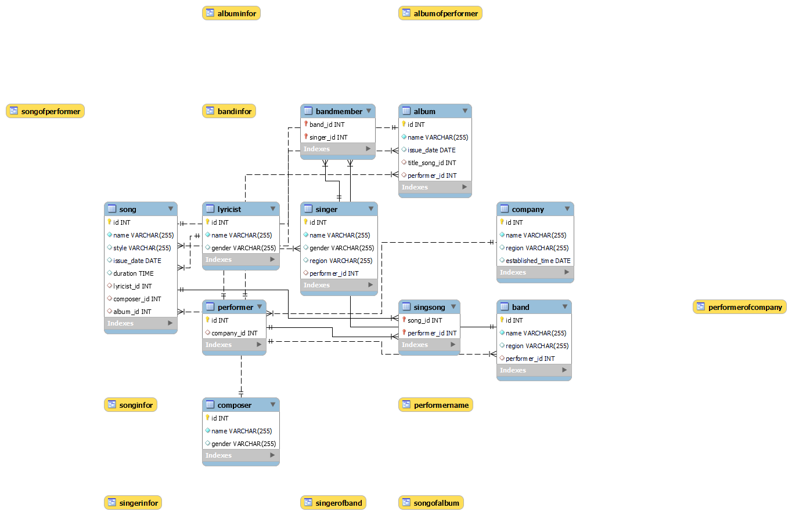

- 👋 Hi, I’m @货又星
- 👀 I’m interested in ...
- 🌱 I’m currently learning ...
- 💞 I’m looking to collaborate on ...
- 📫 How to reach me ...
    * [README 目录（持续更新中） 各种错误处理、爬虫实战及模板、百度智能云人脸识别、计算机视觉深度学习CNN图像识别与分类、PaddlePaddle自然语言处理知识图谱、GitHub、运维...](https://blog.csdn.net/muaamua/article/details/134426428?spm=1001.2014.3001.5502)
    * WeChat：1297767084
    * GitHub：[https://github.com/cxlhyx](https://github.com/cxlhyx)
      
- 😄 Pronouns: ...
- ⚡ Fun fact: ...

<!---
cxlhyx/cxlhyx is a ✨ special ✨ repository because its `README.md` (this file) appears on your GitHub profile.
You can click the Preview link to take a look at your changes.
--->

## 本数据库应用系统
本数据库应用系统（基于SpringBoot + MyBatis plus + Thymeleaf），支持大部分浏览器（如：IE9+浏览器、Google Chrome、火狐浏览器、360浏览器...)、平板、手机等主流设备。

参考：
- [实验三：数据库系统开发](https://www.jianshu.com/p/2fdf72fd03b1)
- [WEB应用系统](https://www.jianshu.com/p/2fdf72fd03b1)

## 数据库
运行前先建立相关数据库，相关脚本存放在sql目录下，直接在workbench或者navicat导入sql脚本即可。
导入后在src/main/resources/application.properties更改数据库配置。

## 运行
在控制台中进入文件夹后使用以下命令，
```shell
gradlew build
gradlew bootRun
```
看到以下画面即为运行成功，

点击倒数第三行的链接即可。

## 效果



## ER图
本数据库的ER图如下

